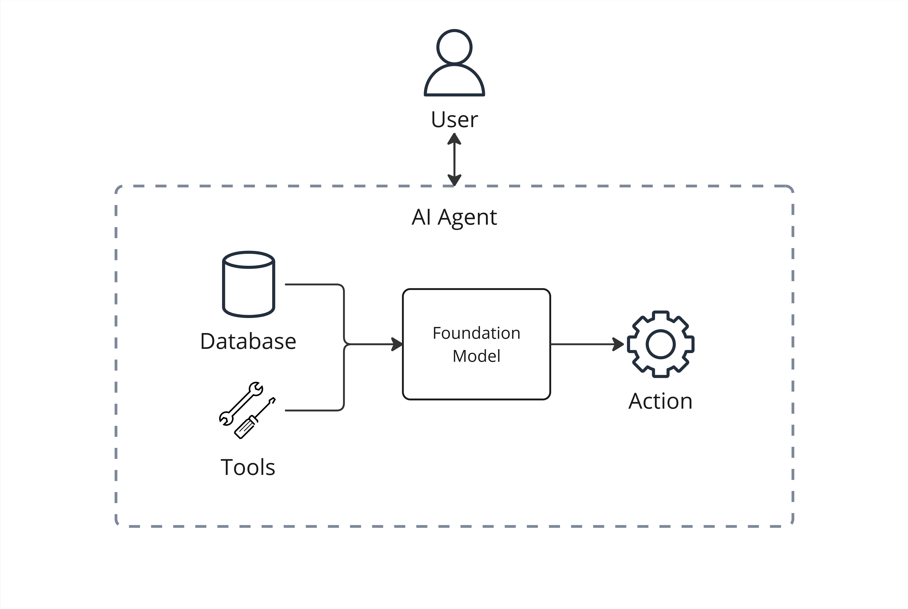

The **Svahnar Agentic AI Framework** is a powerful framework designed to empower not only developers but also non-technical users to create intelligent, autonomous, and effective AI agents. The framework enables you to deploy **Agentic AI systems**, which can **think**, **learn**, and **act** independently to achieve defined goals and purposes.

With the **Svahnar Agentic AI Framework**, you can:

- **Connect** to leading Foundation Models.
- **Integrate** with various tools.
- **Define** specific Do's and Don'ts for AI agents.

Whether you're building **automated workflows**, **decision-making systems**, or **state-of-the-art AI agents**, the Svahnar Agentic AI Framework simplifies the process of designing, deploying, and using Agentic AI solutions.

---

## What Is Agentic AI?

Agentic AI refers to computational systems that operate with a level of **autonomy**, **intelligence**, and **purpose**. Unlike traditional AI systems that simply process inputs and respond with outputs based on predefined rules, Agentic AI is designed to:

- **Perceive** its environment, tools, knowledge repositories, other AI agents, and outside information by collecting and understanding data.
- **Reason** and make plans. By working with other AI agents, it figures out how to solve problems and handles simple tasks like creating content or giving recommendations or complex tasks like working with multiple tools or systems.
- **Act** on its plans to reach goals. It uses external tools and safeguards to make sure its actions are accurate, controlled, and achieve what's intended.
- **Learn** and improve over time by using feedback from its actions to get better at making decisions and performing tasks.




This makes Agentic AI particularly useful for use cases where independent decision-making, dynamic workflows, or autonomous control systems are required.

---

## YAML Configuration for Svahnar Agentic Network

The **Svahnar Agentic AI Framework** offers a convenient way to create agentic networks using **YAML configuration files** and **SVAHNAR Console**. YAML (Yet Another Markup Language) provides a human-readable way to define the structure, data, and behaviors of your Agentic AI network. Creating an Agentic AI system using YAML ensures simplicity, clarity, and flexibility.

### Starting Your YAML Configuration

Every YAML configuration file for creating a Svahnar Agentic Network must include the **top-level key**:

```yaml showLineNumbers starting_point.yaml
create_vertical_agent_network:
```

This top-level key serves as the **starting point** for defining every aspect of the Agentic AI network. Within this key, you will organize all the critical components required to configure and operate the agentic network effectively, including:

- **Connecting to Foundation models**
- **Data and tools integration**
- **Defining agent functions**
- **Orchestration of agent interactions**

The YAML-based approach enables you to craft fully customized, repeatable, and scalable Agentic AI frameworks with ease. By nesting configurations under the `create_vertical_agent_network` key, you ensure that all components are logically structured and easy to manage.

