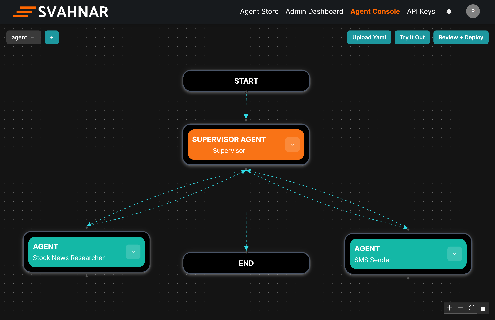

import Card from '@site/src/components/Card';


# Welcome to SVAHNAR Documentation

Explore guides, SDKs, and walkthroughs to help you build, test, and deploy AI agents efficiently using the SVAHNAR Platform.

The SVAHNAR Agentic AI Framework simplifies deployment and hosting of your agents, both internally and externally, via the Agent Store. Additionally, you can serve your agents through **Agents over API** service.

import VersionedLink from '@site/src/components/VersionedLink';
import ArrowRight from '@site/static/icons/right_arrow.svg';


<div className="gallery">    
    <Card link="./Quickstart">

        <div className="side-by-side" >
            <p>
                <h3>Quickstart</h3>
                Create your first AI Agent in minutes using SVAHNAR SDK.
            
                <div>
                <br />
                <br />
                <br />

                    <a href="https://docs.svahnar.com/docs/GetStarted/Quickstart" target="_blank" rel="noopener noreferrer">
                    See Developer Quickstart <ArrowRight className="arrow" />
                    </a>
                </div>
            </p>
                <div className="code-block" >
                  <div className="clickable">
                    ```python showLineNumbers
                    from svahnar import Svahnar

                    client = Svahnar()

                    response = client.agents.create(
                        name="Web Search Agent",
                        description="This Agent is used to search for the information on web or internet and provide the result",
                        deploy_to="Organization",
                        yaml_content=Path("agent.yaml")
                    )
                    print(response)
                    ```
                </div>
                </div>
        </div>
    </Card>
</div>

<br/>
<br/>

<div className="gallery">
  <Card link="./Quickstart">

    <div className="side-by-side">
      <p>
      <h3>Agent Console</h3>
        Create your first AI Agent in seconds using SVAHNAR Agent Console.
        <br />
        <br />
        <div>
            {/* <VersionedLink to="./Quickstart">
                See Guides <ArrowRight className="arrow" />
            </VersionedLink> */}
            <a href="https://platform.svahnar.com" target="_blank" rel="noopener noreferrer">
                See Agent Console <ArrowRight className="arrow" />
            </a>
        </div>
      </p>
      <div className="image">
        
      </div>
    </div>
  </Card>
</div>
