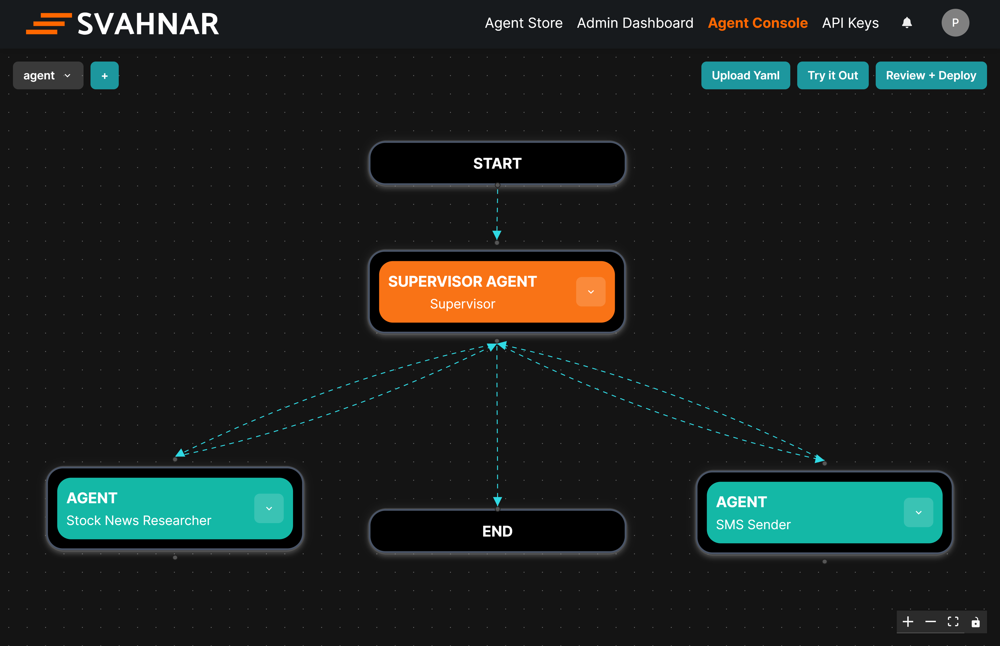

import Card from '@site/src/components/Card';


# Welcome to SVAHNAR Documentation

Explore guides, SDKs, and walkthroughs to help you build, test, and deploy AI agents efficiently using the SVAHNAR Platform.

The SVAHNAR Agentic AI Framework simplifies deployment and hosting of your agents, both internally and externally, via the Agent Store. Additionally, you can serve your agents through **Agents over API** service.

import VersionedLink from '@site/src/components/VersionedLink';
import ArrowRight from '@site/static/icons/right_arrow.svg';


<div className="gallery">    
    <Card link="./Quickstart">

        <div className="side-by-side" >
            <p>
                <h3>Quickstart</h3>
                Create your first AI Agent in two minutes using SVAHNAR SDK.
            
                <div>
                <br />
                <br />
                <br />

                    <a href="https://docs.svahnar.com/docs/GetStarted/Quickstart" target="_blank" rel="noopener noreferrer">
                    See Developer Quickstart <ArrowRight className="arrow" />
                    </a>
                </div>
            </p>
                <div className="code-block" >
                  <div className="clickable">
                    ```python showLineNumbers
                    from svahnar import Svahnar

                    client = Svahnar()

                    response = client.agents.create(
                        name="Web Search Agent",
                        description="This Agent is used to search for the information on web or internet and provide the result",
                        deploy_to="Organization",
                        yaml_content=Path("agent.yaml")
                    )
                    print(response)
                    ```
                </div>
                </div>
        </div>
    </Card>
</div>

<br/>
<br/>

<div className="gallery">
  <Card link="./Quickstart">

    <div className="side-by-side">
      <p>
      <h3>Agent Console</h3>
        Create your first AI Agent in seconds using SVAHNAR Agent Console.
        <br />
        <br />
        <div>
            {/* <VersionedLink to="./Quickstart">
                See Guides <ArrowRight className="arrow" />
            </VersionedLink> */}
            <a href="https://platform.svahnar.com" target="_blank" rel="noopener noreferrer">
                See Agent Console <ArrowRight className="arrow" />
            </a>
        </div>
      </p>
      <div className="image">
        
      </div>
    </div>
  </Card>
</div>

<br/>
<br/>

## Explore SVAHNAR Features

<div className="feature-grid">

  <a href="../AgenticNetwork/introduction" className="feature-card">
    <div className="feature-card-header">
      <div className="feature-card-icon">
        <svg viewBox="0 0 24 24" fill="none" stroke="currentColor" strokeWidth="2" strokeLinecap="round" strokeLinejoin="round"><rect x="9" y="3" width="6" height="6" rx="1"></rect><rect x="3" y="15" width="6" height="6" rx="1"></rect><rect x="15" y="15" width="6" height="6" rx="1"></rect><path d="M12 9v6"></path><path d="M12 15H6v0"></path><path d="M12 15h6v0"></path></svg>
      </div>
      <h3>AI Framework</h3>
    </div>
    <p>Build and orchestrate single agents or agentic networks using the Python SDK.</p>
    <div className="feature-card-link">
      Learn Framework <ArrowRight className="arrow" />
    </div>
  </a>

  <a href="../Agents/create_agent" className="feature-card">
    <div className="feature-card-header">
      <div className="feature-card-icon">
        <svg viewBox="0 0 24 24" fill="none" stroke="currentColor" strokeWidth="2" strokeLinecap="round" strokeLinejoin="round"><rect x="3" y="11" width="18" height="10" rx="2"></rect><circle cx="12" cy="5" r="2"></circle><path d="M12 7v4"></path><line x1="8" y1="16" x2="8" y2="16"></line><line x1="16" y1="16" x2="16" y2="16"></line></svg>
      </div>
      <h3>Agents API</h3>
    </div>
    <p>Programmatically validate, test, run, and manage your AI agent instances.</p>
    <div className="feature-card-link">
      Explore API <ArrowRight className="arrow" />
    </div>
  </a>

  <a href="../Keyvault/Keyvault" className="feature-card">
    <div className="feature-card-header">
      <div className="feature-card-icon">
        <svg viewBox="0 0 24 24" fill="none" stroke="currentColor" strokeWidth="2" strokeLinecap="round" strokeLinejoin="round"><path d="M12 22s8-4 8-10V5l-8-3-8 3v7c0 6 8 10 8 10"></path></svg>
      </div>
      <h3>Keyvault</h3>
    </div>
    <p>Securely store, retrieve, and revoke credentials and API keys used by your agents.</p>
    <div className="feature-card-link">
      Secure Keys <ArrowRight className="arrow" />
    </div>
  </a>

  <a href="../MCP/usage" className="feature-card">
    <div className="feature-card-header">
      <div className="feature-card-icon">
        <svg viewBox="0 0 180 180" fill="none"><path d="M18 84.8528L85.8822 16.9706C95.2548 7.59798 110.451 7.59798 119.823 16.9706V16.9706C129.196 26.3431 129.196 41.5391 119.823 50.9117L68.5581 102.177" stroke="currentColor" stroke-width="12" stroke-linecap="round"/><path d="M69.2652 101.47L119.823 50.9117C129.196 41.5391 144.392 41.5391 153.765 50.9117L154.118 51.2652C163.491 60.6378 163.491 75.8338 154.118 85.2063L92.7248 146.6C89.6006 149.724 89.6006 154.789 92.7248 157.913L105.331 170.52" stroke="currentColor" stroke-width="12" stroke-linecap="round"/><path d="M102.853 33.9411L52.6482 84.1457C43.2756 93.5183 43.2756 108.714 52.6482 118.087V118.087C62.0208 127.459 77.2167 127.459 86.5893 118.087L136.794 67.8822" stroke="currentColor" stroke-width="12" stroke-linecap="round"/></svg>
      </div>
      <h3>MCP</h3>
    </div>
    <p>Use Model Context Protocol to seamlessly connect agents to external tools and context.</p>
    <div className="feature-card-link">
      Configure MCP <ArrowRight className="arrow" />
    </div>
  </a>

  <a href="../Tools/Understanding_Tools" className="feature-card">
    <div className="feature-card-header">
      <div className="feature-card-icon">
        <svg viewBox="0 0 24 24" fill="none" stroke="currentColor" strokeWidth="2" strokeLinecap="round" strokeLinejoin="round"><path d="M14.7 6.3a1 1 0 0 0 0 1.4l1.6 1.6a1 1 0 0 0 1.4 0l3.77-3.77a6 6 0 0 1-7.94 7.94l-6.91 6.91a2.12 2.12 0 0 1-3-3l6.91-6.91a6 6 0 0 1 7.94-7.94l-3.76 3.76z"></path></svg>
      </div>
      <h3>Tools</h3>
    </div>
    <p>Equip your agents with Google Search, Finance APIs, and Human-in-the-Loop workflows.</p>
    <div className="feature-card-link">
      Equip Tools <ArrowRight className="arrow" />
    </div>
  </a>

  <a href="../KnowledgeRepository/Overview" className="feature-card">
    <div className="feature-card-header">
      <div className="feature-card-icon">
        <svg viewBox="0 0 24 24" fill="none" stroke="currentColor" strokeWidth="2" strokeLinecap="round" strokeLinejoin="round"><ellipse cx="12" cy="5" rx="9" ry="3"></ellipse><path d="M3 5V19A9 3 0 0 0 21 19V5"></path><path d="M3 12A9 3 0 0 0 21 12"></path></svg>
      </div>
      <h3>Knowledge Repo</h3>
    </div>
    <p>Connect documents, file databases, and vector storage to agent memory.</p>
    <div className="feature-card-link">
      Connect Memory <ArrowRight className="arrow" />
    </div>
  </a>

  <a href="../Connections/Overview" className="feature-card">
    <div className="feature-card-header">
      <div className="feature-card-icon">
        <svg viewBox="0 0 24 24" fill="none" stroke="currentColor" strokeWidth="2" strokeLinecap="round" strokeLinejoin="round"><path d="M10 13a5 5 0 0 0 7.54.54l3-3a5 5 0 0 0-7.07-7.07l-1.72 1.71"></path><path d="M14 11a5 5 0 0 0-7.54-.54l-3 3a5 5 0 0 0 7.07 7.07l1.71-1.71"></path></svg>
      </div>
      <h3>OAuth Connections</h3>
    </div>
    <p>Set up Slack, Google, GitHub, Outlook, and other OAuth integration services for agent actions.</p>
    <div className="feature-card-link">
      Manage OAuth <ArrowRight className="arrow" />
    </div>
  </a>

  <a href="../additional/YAML_Conversion_Guide" className="feature-card">
    <div className="feature-card-header">
      <div className="feature-card-icon">
        <svg viewBox="0 0 24 24" fill="none" stroke="currentColor" strokeWidth="2" strokeLinecap="round" strokeLinejoin="round"><circle cx="12" cy="12" r="10"></circle><line x1="12" y1="16" x2="12" y2="12"></line><line x1="12" y1="8" x2="12.01" y2="8"></line></svg>
      </div>
      <h3>Guides & Resources</h3>
    </div>
    <p>Access conversion guides, configuration schemas, and other resources.</p>
    <div className="feature-card-link">
      View Resources <ArrowRight className="arrow" />
    </div>
  </a>

</div>


