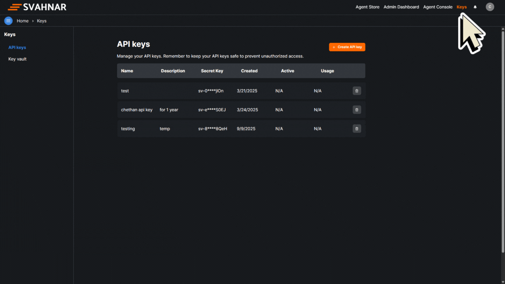

import { Steps, Step } from '@site/src/components/Steps/Steps';
import Tabs from '@theme/Tabs';
import TabItem from '@theme/TabItem';

Set up your SVAHNAR environment and create your first agent in minutes using the SVAHNAR SDK. This guide will walk you through the steps to get started quickly.

### Configure your development environment
To start using the SVAHNAR SDK, you need to set up your development environment. This includes installing the necessary dependencies and getting your API key.

Before you start with the development, you need to create and export an API key. This key will be used to authenticate your requests to the SVAHNAR API.
<Steps>
    <Step title='Get an API Key'>
    Create a new API Key in the [SVAHNAR Platform](https://platform.svahnar.com/). Navigate to the API keys section in your account. Create a new API key and copy it.

    
    </Step>
    <Step title='Export the API key'>
    Export the API key as an environment variable
    <Tabs>
        <TabItem value="mac/linux" label="macOS / Linux" default>
            ```js title="Export an env variable on macOS or Linux systems"
            export SVAHNAR_API_KEY="your_api_key_here"
            ```    
        </TabItem>
        <TabItem value="windows" label="Windows">
            ```js title="Export an env variable in PowerShell"
            setx SVAHNAR_API_KEY "your_api_key_here"
            ```
        </TabItem>
    </Tabs>
    </Step>
    <Step title='Install the SVAHNAR SDK'>
    Install the SVAHNAR SDK using pip. Open your terminal and run the following command:
    <Tabs>
        <TabItem value="pip" label="Python" default>
            ```bash title="Install the SVAHNAR SDK using pip"
            pip install svahnar
            ```
        </TabItem>
    </Tabs>
    </Step>
    <Step title='Create your first agent'>
    To verify that the SVAHNAR SDK is installed correctly, create a file `test.py` and add the following code:
    ```python title="test.py" showLineNumbers
    from svahnar import Svahnar
    from pathlib import Path

    client = Svahnar()

    response = client.agents.create(
        name="Web Search Agent",
        description="This Agent is used to search for the information on web or internet and provide the result",
        deploy_to="Organization",
        yaml_content=Path("agent.yaml")
    )
    print(response)
    ```
    Execute the code with `python test.py`. In a few moments, you should see the output of your API request.
    :::info
    Make sure to replace `agent.yaml` with the path to your agent configuration file.
    You can find the example agent configuration YAML below
    :::


    ```yaml showLineNumbers title="agent.yaml" showLineNumbers
    create_vertical_agent_network:
        agent-1:
            agent_name: "Web_search"
            LLM_config:
                params:
                model: "gpt-5"
                max_tokens: 1000
                request_timeout: 600
            tools:
            tool_assigned:
                - name: "Tavily"
                config:
                    max_results: 5
            agent_function:
            - "Your function is to search the web or internet for information"
            incoming_edge:
            - "Start"
            outgoing_edge: []
    ```
    </Step>

</Steps>
