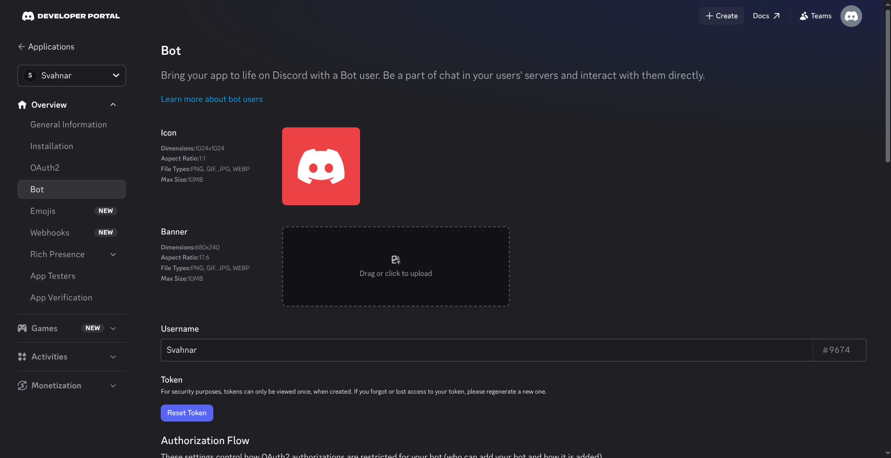
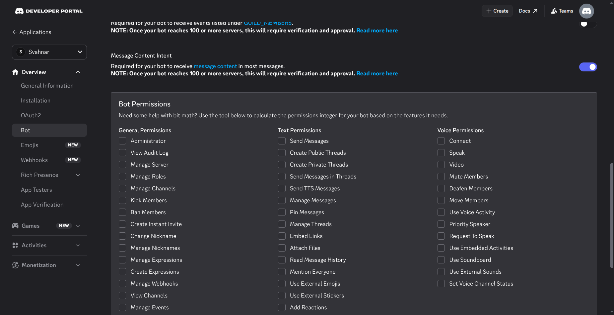

import Video from '@site/src/components/Video';
import { Steps, Step } from '@site/src/components/Steps/Steps';

# Discord

Empower your agents to send messages, read channel history, and search conversations directly through **Discord**.

This guide will walk you through creating a Discord Bot, inviting it to your server, and configuring the SVAHNAR tool.

## 💡 Core Concepts

To configure this tool effectively, you need to understand the underlying capabilities, the bot permission model, and how the tool authenticates.

### 1. What can this tool do?

The Discord tool interacts with the **Discord REST API** (not WebSocket) to send and retrieve messages from channels your bot has been invited to.

| Mode | Description | `text` Required |
| --- | --- | --- |
| `send` | Send a message to a specified Discord channel. | Yes — the message content to post. |
| `read` | Fetch the latest messages from a channel (up to 100). | No |
| `search` | Search for a specific string in the last 100 messages of a channel. | Yes — the text to search for. |

### 2. Authentication

This tool uses a **Discord Bot Token** for authentication via the REST API.

* **Bot Token:** A static token tied to your Discord bot application. Passed as `Authorization: Bot <token>` on every request.
* **No OAuth popup required:** You generate the token once from the Discord Developer Portal and paste it into SVAHNAR. No per-user login flow needed.
* **Maintenance:** Bot tokens do not expire automatically. They are invalidated only if you manually reset the token from the Developer Portal or if the bot application is deleted.

### 3. REST API vs WebSocket

Discord has two API surfaces — REST and Gateway (WebSocket). This tool uses the **REST API only**, which means:

* ✅ The agent can **send and read** messages on demand (polling model).
* ❌ The agent cannot **listen** for new messages in real time or react to events as they happen.

For real-time event-driven workflows (e.g., responding the moment a message arrives), a WebSocket Gateway connection would be required — outside the scope of this tool.

### 4. Operation Parameter Contract

| Parameter | Required When | Description |
| --- | --- | --- |
| `channel_id` | Always | The Discord channel ID as a string or integer. |
| `mode` | Optional | `send` (default) \| `read` \| `search` |
| `text` | `send`, `search` | Message content to post (`send`) or string to search for (`search`). |
| `limit` | Optional (`read` only) | Number of messages to fetch. Default: `10`, max: `100`. |

---

## 🔑 Prerequisites

Before configuring the tool in SVAHNAR, you need to create a **Discord Bot** from the Discord Developer Portal and invite it to your server.

<Steps>
<Step>

### Create a Discord Application & Bot

1. Go to the [Discord Developer Portal](https://discord.com/developers/applications) and log in.
2. Click **New Application**, give it a name (e.g., `SVAHNAR Agent`), and click **Create**.
3. In the left sidebar, go to **Bot**.
4. Click **Add Bot** → **Yes, do it!**
5. Under the **Token** section, click **Reset Token**, confirm, and **copy the token immediately** — it is shown only once.



:::caution
Never share or commit your Bot Token. Anyone with this token can operate your bot with full permissions. Store it in SVAHNAR Key Vault (`${discord_bot_token}`) and nowhere else.
:::

</Step>

<Step>

### Configure Bot Permissions

1. In the **Bot** section of the Developer Portal, scroll down to **Privileged Gateway Intents**.
2. Enable **Message Content Intent** — required to read message content via the REST API.
3. Save your changes.



:::note
Without the **Message Content Intent**, the `read` and `search` modes will return messages with empty content bodies. This intent must be enabled even though this tool uses REST, not the Gateway.
:::

</Step>

<Step>

### Invite the Bot to Your Server

1. In the left sidebar, go to **OAuth2** → **URL Generator**.
2. Under **Scopes**, select `bot`.
3. Under **Bot Permissions**, select:
   * `Read Messages / View Channels`
   * `Send Messages`
   * `Read Message History`
4. Copy the generated URL and open it in your browser.
5. Select the target server from the dropdown and click **Authorize**.

:::tip
You must have **Manage Server** permission on the target Discord server to invite a bot. If you don't have this, ask your server admin to complete this step.
:::

</Step>

<Step>

### Get the Channel ID

1. In Discord, go to **User Settings** → **Advanced** → enable **Developer Mode**.
2. Right-click on any channel in your server → **Copy Channel ID**.
3. This is the `channel_id` value you will pass in your agent payloads.

</Step>
</Steps>

---

## ⚙️ Configuration Steps

<Steps>
<Step>

### Add the Tool in SVAHNAR

1. Open your **SVAHNAR Agent Configuration**.
2. Add the **Discord** tool and enter your bot credentials:
   * `DISCORD_BOT_TOKEN` — the Bot Token from the Discord Developer Portal

3. Save the configuration.

</Step>

<Step>

### Verify the Connection

To confirm your bot token is valid and the bot has access to the target channel:

1. Trigger a test agent run using the `read` mode with your target `channel_id` and `limit: 1`.
2. A valid response will return the most recent message in that channel.
3. If you receive a `401` error, your token is invalid or was not copied in full.
4. If you receive a `403 Missing Access` error, the bot has not been invited to the server or does not have permission to view that specific channel.

</Step>
</Steps>

---

## 📚 Practical Recipes (Examples)

### Recipe 1: Notification & Alerting Agent

> **Use Case:** An agent that posts automated updates, alerts, or summaries to a Discord channel.

```yaml showLineNumbers
create_vertical_agent_network:
  agent-1:
    agent_name: discord_notifier_agent
    LLM_config:
        params:
          model: gpt-4o
    tools:
      tool_assigned:
        - name: Discord
          config:
            DISCORD_BOT_TOKEN: ${discord_bot_token}
    agent_function:
      - You are a notification delivery assistant.
      - When triggered, compose a clear and concise alert message based on the event data provided.
      - Use 'send' mode with the target channel_id to post the notification to the correct Discord channel.
      - Keep messages under 2000 characters — Discord's per-message limit. If content is longer, split it into multiple 'send' calls.
    incoming_edge:
      - Start
    outgoing_edge: []
```

---

### Recipe 2: Channel Monitor & Search Agent

> **Use Case:** An agent that scans a Discord channel for specific keywords and summarizes matching messages.

```yaml showLineNumbers
create_vertical_agent_network:
  agent-1:
    agent_name: channel_monitor_agent
    LLM_config:
        params:
          model: gpt-4o
    tools:
      tool_assigned:
        - name: Discord
          config:
            DISCORD_BOT_TOKEN: ${discord_bot_token}
    agent_function:
      - You are a channel monitoring assistant.
      - Use 'search' mode with the target channel_id and the keyword or phrase to look for in the last 100 messages.
      - Summarize all matching messages — include the author, timestamp, and relevant excerpt for each match.
      - If no matches are found, report that clearly rather than returning an empty response.
      - Use 'read' mode with a higher limit (up to 100) when the user wants a full digest of recent channel activity.
    incoming_edge:
      - Start
    outgoing_edge: []
```

---

### Recipe 3: Cross-Tool — Pipeline Status Reporter Agent

> **Use Case:** An agent that checks a data source (e.g., GitLab issues or HubSpot deals) and posts a formatted daily digest to a Discord channel.

```yaml showLineNumbers
create_vertical_agent_network:
  agent-1:
    agent_name: pipeline_status_reporter
    LLM_config:
        params:
          model: gpt-4o
    tools:
      tool_assigned:
        - name: GitLab
          config:
            GITLAB_PERSONAL_ACCESS_TOKEN: ${gitlab_token}
            GITLAB_REPOSITORY: ${gitlab_repo}
        - name: Discord
          config:
            DISCORD_BOT_TOKEN: ${discord_bot_token}
    agent_function:
      - You are a daily pipeline status reporter.
      - Use GitLab's 'get_issues' to fetch all open issues in the repository.
      - Group the issues by label or severity and compose a clean daily digest summary.
      - Use Discord's 'send' mode to post the digest to the designated engineering channel_id.
      - Keep the format consistent — use Discord markdown (bold with **text**, code blocks with `backticks`) for readability.
    incoming_edge:
      - Start
    outgoing_edge: []
```

### 💡 Tip: SVAHNAR Key Vault

Never hardcode your `DISCORD_BOT_TOKEN` in plain text files. Use SVAHNAR Key Vault references (e.g., `${discord_bot_token}`) to keep credentials secure.

### 💡 Tip: Discord Markdown

Discord supports a subset of Markdown in messages sent via the API. Use these in your `send` payloads for readable, well-formatted notifications:

| Format | Syntax |
| --- | --- |
| Bold | `**text**` |
| Italic | `*text*` |
| Code (inline) | `` `code` `` |
| Code block | ` ```language\ncode\n``` ` |
| Block quote | `> text` |

---

## 🚑 Troubleshooting

* **`401 Unauthorized`**
  * Your `DISCORD_BOT_TOKEN` is invalid or was not copied in full.
  * Go to **Discord Developer Portal → Your App → Bot → Reset Token**, copy the new token, and update it in SVAHNAR Key Vault.

* **`403 Missing Access` on `read` or `send`**
  * The bot has not been invited to the server, or it does not have the required permissions on that specific channel.
  * Re-invite the bot using the OAuth2 URL Generator with `Read Messages`, `Send Messages`, and `Read Message History` scopes. Also check the channel's **Edit Channel → Permissions** to ensure the bot role is not explicitly denied.

* **`read` and `search` Return Messages with Empty Content**
  * The **Message Content Intent** is not enabled in the Developer Portal.
  * Go to **Developer Portal → Your App → Bot → Privileged Gateway Intents** and enable **Message Content Intent**, then save.

* **`search` Returns No Matches**
  * The `search` mode scans only the **last 100 messages** in a channel. If the target message is older than the last 100, it will not be found.
  * For broader historical searches, use `read` with `limit: 100` and process the results in the agent.

* **`send` Fails with Message Too Long**
  * Discord enforces a **2000 character per message** limit. If your agent's output exceeds this, split the content across multiple `send` calls.
  * Structure long outputs as multiple short messages or use a code block for dense content.

* **Bot Not Appearing in the Server After Invite**
  * Confirm you selected the correct server in the OAuth invite URL flow and clicked **Authorize**.
  * Check that the inviting account has **Manage Server** permission on the target server — without this, the invite silently fails.