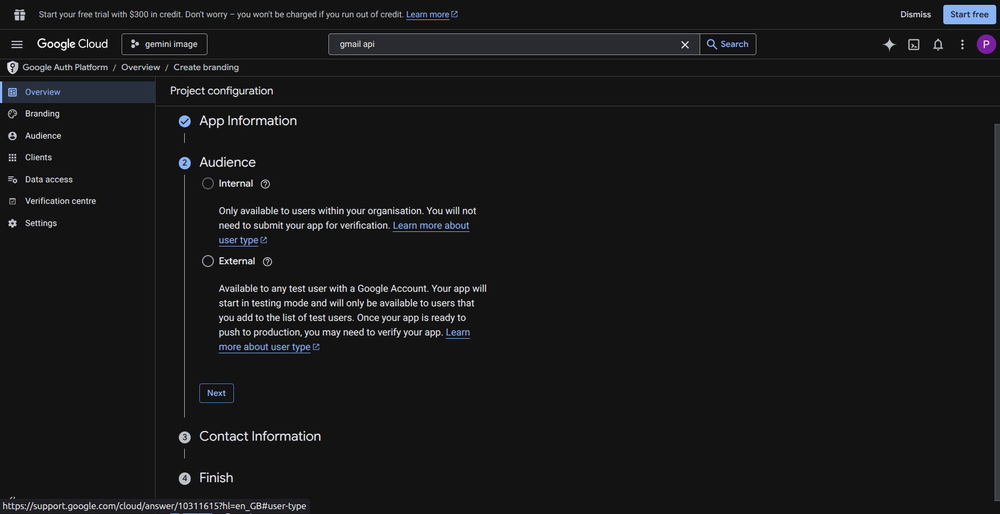
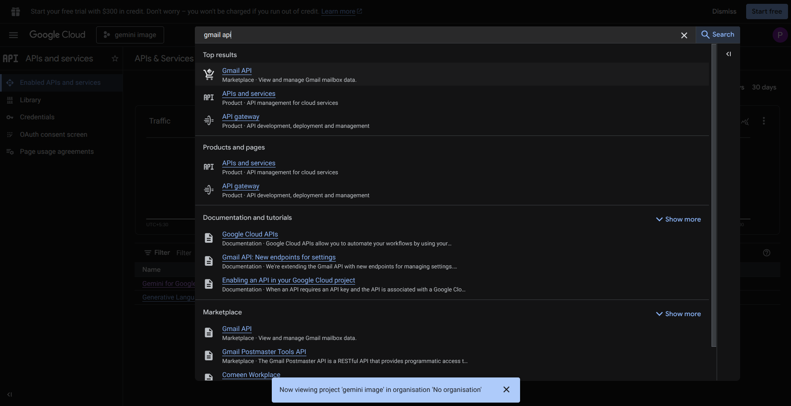

import Video from '@site/src/components/Video';
import { Steps, Step } from '@site/src/components/Steps/Steps';

# Gmail

Empower your agents to search and retrieve emails from a user's **Gmail** inbox.

This guide will walk you through creating a Google Cloud OAuth app, enabling the Gmail API, and authenticating your user.

## 💡 Core Concepts

To configure this tool effectively, you need to understand the underlying capabilities, the payload structure, and Gmail's search operator syntax.

### 1. What can this tool do?

The Gmail tool interacts with the **Gmail API** to search a user's inbox using Gmail's native search operator syntax — the same powerful query language available in the Gmail search bar.

| Task | Description |
| --- | --- |
| `query` | Search for emails matching Gmail search operators and return matching messages. |

Every payload must include both a `task` and a `query` field:

```json
{
  "task": "query",
  "query": "from:me"
}
```

### 2. Authentication

This tool uses **Google OAuth 2.0** — a `client_id` + `client_secret` pair that drives a per-user authorization flow.

* **First Run:** Each user must complete a one-time OAuth consent flow via the **Authenticate** button in the SVAHNAR tool UI. Tokens are stored securely in Redis.
* **Token Refresh:** Gmail OAuth access tokens expire after 1 hour but are automatically refreshed using the stored refresh token — no user action needed.
* **Maintenance:** If a user revokes access from their [Google Account permissions page](https://myaccount.google.com/permissions), re-authentication is required.

### 3. Gmail Search Operator Syntax

All searches use Gmail's native search syntax in the `query` field. Every operator available in the Gmail search bar works identically here.

**Sender & Recipient Operators**

| Operator | Description | Example |
| --- | --- | --- |
| `from:` | Emails from a specific sender. | `from:amy@example.com` |
| `to:` | Emails sent to a specific recipient. | `to:john@example.com` |
| `cc:` | Emails with someone in the Cc field. | `cc:john@example.com` |
| `bcc:` | Emails with someone in the Bcc field. | `bcc:david@example.com` |
| `deliveredto:` | Emails delivered to a specific address. | `deliveredto:username@example.com` |
| `list:` | Emails from a mailing list. | `list:info@example.com` |

**Subject & Content Operators**

| Operator | Description | Example |
| --- | --- | --- |
| `subject:` | Emails matching a word or phrase in the subject. | `subject:invoice`, `subject:anniversary party` |
| `" "` | Emails containing an exact phrase. | `"quarterly business review"` |
| `( )` | Group multiple terms together. | `subject:(invoice payment)` |
| `+` | Match a word exactly, no synonyms. | `+unicorn` |
| `AROUND` | Words appearing near each other within N words. | `holiday AROUND 10 vacation` |

**Date Operators**

| Operator | Description | Example |
| --- | --- | --- |
| `after:` / `before:` | Emails received within a date range. | `after:2024/01/01`, `before:2024/06/30` |
| `older_than:` / `newer_than:` | Relative time — use `d` (day), `m` (month), `y` (year). | `newer_than:2d`, `older_than:1y` |

**Label, Category & Status Operators**

| Operator | Description | Example |
| --- | --- | --- |
| `label:` | Emails under a specific Gmail label. | `label:invoices`, `label:important` |
| `category:` | Emails in an inbox category. | `category:social`, `category:updates` |
| `is:` | Emails filtered by status. | `is:unread`, `is:starred`, `is:important` |
| `is:muted` | Emails that have been muted. | `is:muted subject:team celebration` |
| `has:yellow-star` | Emails with a specific star color. | `has:yellow-star OR has:purple-question` |
| `has:userlabels` | Emails that have any user label applied. | `has:userlabels` |
| `has:nouserlabels` | Emails without any user label. | `has:nouserlabels` |
| `label:encryptedmail` | Emails sent with client-side encryption. | `label:encryptedmail` |

**Attachment Operators**

| Operator | Description | Example |
| --- | --- | --- |
| `has:attachment` | Emails with any attachment. | `has:attachment` |
| `has:drive` | Emails with a Google Drive file. | `has:drive` |
| `has:document` | Emails with a Google Doc attached. | `has:document` |
| `filename:` | Emails with a specific attachment name or file type. | `filename:pdf`, `filename:report.xlsx` |

**Location Operators**

| Operator | Description | Example |
| --- | --- | --- |
| `in:anywhere` | Search all of Gmail including Spam and Trash. | `in:anywhere subject:contract` |
| `in:archive` | Search archived messages only. | `in:archive payment reminder` |
| `in:snoozed` | Search snoozed emails. | `in:snoozed birthday reminder` |

**Size Operators**

| Operator | Description | Example |
| --- | --- | --- |
| `size:` | Emails matching an exact size in bytes. | `size:1000000` |
| `larger:` | Emails larger than a given size. | `larger:10M` |
| `smaller:` | Emails smaller than a given size. | `smaller:5M` |

**Advanced Operators**

| Operator | Description | Example |
| --- | --- | --- |
| `rfc822msgid:` | Find an email by its raw message-id header. | `rfc822msgid:200503292@example.com` |

**Combining Conditions**

```
# AND — space-separated is implicit AND
from:boss@company.com is:unread

# Explicit AND
from:amy AND to:david

# OR
from:amy OR from:david

# Curly brace OR shorthand
{from:amy from:david}

# Exclusion with -
subject:invoice -from:noreply@example.com

# Exact phrase
"project kickoff meeting"

# Grouping
subject:(invoice payment)

# AROUND — words within N words of each other
holiday AROUND 10 vacation
```

---

## 🔑 Prerequisites

<Steps>
<Step>

### Create a Google Cloud Project

1. Go to the [Google Cloud Console](https://console.cloud.google.com) and sign in.
2. Click **Select a project** → **New Project**.
3. Name it (e.g., `SVAHNAR Agent`) and click **Create**.



:::note
If you already created a Cloud project for Google Drive or Google Calendar, reuse the same project — just enable the Gmail API alongside the others.
:::

</Step>

<Step>

### Enable the Gmail API

1. In your project, go to **APIs & Services** → **Library**.
2. Search for **Gmail API** and click **Enable**.



</Step>

<Step>

### Configure the OAuth Consent Screen

1. Go to **APIs & Services** → **OAuth consent screen**.
2. Select **External** (for users outside your org) or **Internal** (for Google Workspace orgs only).
3. Fill in the app name, support email, and developer contact email.
4. Under **Scopes**, click **Add or Remove Scopes** and add:
   * `https://www.googleapis.com/auth/gmail.readonly`
5. Save and continue. For External apps in Testing mode, add target user emails under **Test Users**.

:::caution
Gmail scopes are classified as **sensitive** by Google. An External app with Gmail scopes will display a security warning to users until it passes Google's verification review. For development, add users to the **Test Users** list. For production, submit the app for verification.
:::

</Step>

<Step>

### Generate OAuth Credentials

1. Go to **APIs & Services** → **Credentials** → **Create Credentials** → **OAuth client ID**.
2. Select **Web application** as the application type.
3. Under **Authorized redirect URIs**, add your SVAHNAR callback URL:
```
https://api.platform.svahnar.com/api/v1/google_auth
```
4. Click **Create**. Note your **Client ID** and **Client Secret**.

:::tip
If you already created OAuth credentials for Google Drive or Calendar, add the Gmail redirect URI to the same credential — Google OAuth clients support multiple redirect URIs. One Cloud project and one credential set covers all three Google tools.
:::

</Step>
</Steps>

---

## ⚙️ Configuration Steps

<Steps>
<Step>

### Add the Tool in SVAHNAR

1. Open your **SVAHNAR Agent Configuration**.
2. Add the **Gmail** tool and enter your OAuth credentials:
   * `client_id` — from your Google Cloud OAuth client
   * `client_secret` — from your Google Cloud OAuth client

3. Save the configuration.

</Step>

<Step>

### Authenticate

1. Click the **Authenticate** button in the Gmail tool UI.
2. A Google consent screen will appear — log in with the target Gmail account and grant read access.
3. After approval, SVAHNAR stores the access and refresh tokens in Redis automatically.
4. All subsequent calls resolve credentials without re-authentication.

</Step>
</Steps>

---

## 📚 Query Reference

| What you want to find | Query |
| --- | --- |
| Emails from a specific sender | `from:amy@example.com` |
| Unread emails | `is:unread` |
| Starred emails | `is:starred` |
| Emails with any attachment | `has:attachment` |
| Emails with a PDF attached | `filename:pdf` |
| Emails with a Google Drive file | `has:drive` |
| Emails after a specific date | `after:2024/06/01` |
| Emails from the last 2 days | `newer_than:2d` |
| Emails older than 1 year | `older_than:1y` |
| Emails in a specific label | `label:invoices` |
| Emails in a category | `category:updates` |
| Archived emails | `in:archive` |
| Snoozed emails | `in:snoozed` |
| Emails including Spam & Trash | `in:anywhere subject:contract` |
| Emails larger than 10MB | `larger:10M` |
| Emails matching an exact phrase | `"quarterly business review"` |
| Emails from A or B | `from:alice OR from:bob` |
| Invoices, not from noreply | `subject:invoice -from:noreply` |
| Unread emails from your boss | `from:boss@company.com is:unread` |
| Recent emails with attachments | `has:attachment newer_than:7d` |

---

## 📚 Practical Recipes (Examples)

### Recipe 1: Inbox Triage Agent

> **Use Case:** An agent that scans unread emails and produces a prioritized summary by sender and urgency.

```yaml showLineNumbers
create_vertical_agent_network:
  agent-1:
    agent_name: inbox_triage_agent
    LLM_config:
        params:
          model: gpt-4o
    tools:
      tool_assigned:
        - name: Gmail
          config:
            client_id: ${google_client_id}
            client_secret: ${google_client_secret}
    agent_function:
      - You are an inbox triage assistant.
      - Use task 'query' with query 'is:unread' to fetch all unread messages.
      - Group results by sender and subject.
      - Flag emails with urgency signals — keywords like 'urgent', 'action required', 'deadline', or 'invoice' in the subject.
      - Return a prioritized digest — urgent items first, FYI items second, newsletters last.
    incoming_edge:
      - Start
    outgoing_edge: []
```

---

### Recipe 2: Invoice & Receipt Finder Agent

> **Use Case:** An agent that surfaces all financial emails — invoices, receipts, and payment confirmations.

```yaml showLineNumbers
create_vertical_agent_network:
  agent-1:
    agent_name: invoice_finder_agent
    LLM_config:
        params:
          model: gpt-4o
    tools:
      tool_assigned:
        - name: Gmail
          config:
            client_id: ${google_client_id}
            client_secret: ${google_client_secret}
    agent_function:
      - You are a financial email assistant.
      - Use task 'query' with query 'subject:(invoice OR receipt OR payment) has:attachment newer_than:3m' to surface recent financial emails.
      - Extract sender, subject, and date from each result.
      - Return a structured list sorted by date — most recent first.
    incoming_edge:
      - Start
    outgoing_edge: []
```

---

### Recipe 3: Cross-Tool — Gmail → HubSpot Lead Capture Agent

> **Use Case:** An agent that reads inbound sales inquiry emails and automatically creates HubSpot contacts.

```yaml showLineNumbers
create_vertical_agent_network:
  agent-1:
    agent_name: gmail_hubspot_lead_capture
    LLM_config:
        params:
          model: gpt-4o
    tools:
      tool_assigned:
        - name: Gmail
          config:
            client_id: ${google_client_id}
            client_secret: ${google_client_secret}
        - name: HubSpot
          config:
            access_token: ${hubspot_token}
    agent_function:
      - You are a lead capture agent.
      - Use Gmail task 'query' with query 'label:sales-inquiries is:unread' to find new inbound sales emails.
      - Extract sender name, email address, and any company name mentioned in the email.
      - For each sender, use HubSpot 'search' on contacts with an EQ filter on email to check if they already exist.
      - If not found, use HubSpot 'create' to add them as a new contact with LeadSource set to 'Email'.
    incoming_edge:
      - Start
    outgoing_edge: []
```

### 💡 Tip: SVAHNAR Key Vault

Never hardcode your `client_secret` in plain text files. Use SVAHNAR Key Vault references (e.g., `${google_client_secret}`) to keep credentials secure. If you use the same Google Cloud project for Drive, Gmail, and Calendar, the same `client_id` and `client_secret` apply across all three tools.

---

## 🚑 Troubleshooting

* **`401 Unauthorized` or Token Errors**
  * The user's OAuth tokens are missing or invalid. Click **Authenticate** again to re-run the consent flow.
  * If the user revoked access from [Google Account Permissions](https://myaccount.google.com/permissions), re-authentication is mandatory.

* **`403 Insufficient Permission`**
  * The granted scope does not cover the operation. Verify that `gmail.readonly` is listed in your OAuth Consent Screen scopes and re-authenticate.

* **Query Returns No Results**
  * Test the identical query directly in the Gmail search bar first. If it returns results there but not via the tool, check for any whitespace or encoding issues in the payload string.
  * Date formats for `after:` and `before:` use `YYYY/MM/DD` — not ISO 8601. For relative dates, use `newer_than:` and `older_than:` instead.

* **Emails in Spam or Trash Not Appearing**
  * Gmail excludes Spam and Trash from search by default. Prefix your query with `in:anywhere` to include them — e.g., `in:anywhere subject:contract`.

* **`App Not Verified` Warning on Consent Screen**
  * Your OAuth app is in Testing mode. Add the user's email under **Test Users** in the OAuth Consent Screen to bypass the warning during development.
  * For production with external users, submit your app for Google's verification review.

* **`rfc822msgid:` Returning No Match**
  * The message-id value must be copied exactly from the raw email headers — including any angle brackets if present. A single character mismatch returns no results.