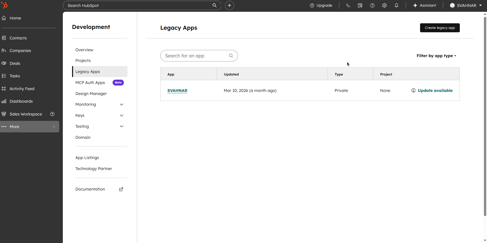
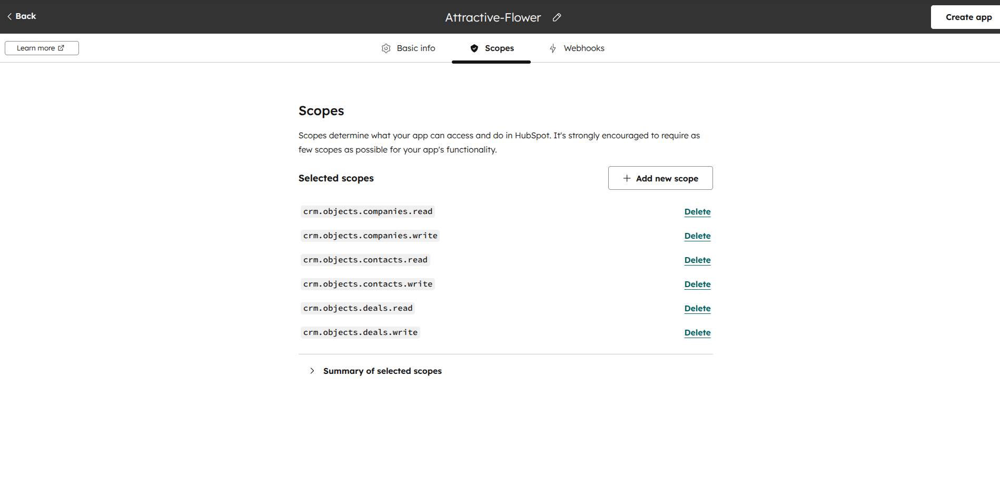

import Video from '@site/src/components/Video';
import { Steps, Step } from '@site/src/components/Steps/Steps';

# HubSpot 

Empower your agents to manage contacts, companies, deals, and tickets directly through **HubSpot CRM**.

This guide will walk you through generating your HubSpot Private App token, configuring the SVAHNAR tool, and connecting your CRM workspace.

## 💡 Core Concepts

To configure this tool effectively, you need to understand the underlying capabilities and the data model.

### 1. What can this tool do?

The HubSpot tool interacts with the **HubSpot CRM API v3/v4** to perform full CRUD, filter-based search, and association management across four core object types.

**Supported Object Types:** `contacts` | `companies` | `deals` | `tickets`

| Operation | Description |
| --- | --- |
| `create` | Create a new CRM record (contact, company, deal, or ticket). |
| `get` | Fetch a single record by its HubSpot ID with optional property selection. |
| `update` | Partially update specific fields on an existing record. |
| `delete` | Soft-delete (archive) a record. Recoverable in HubSpot UI for 90 days. |
| `search` | Filter-based search across any object type with sort and limit support. |
| `associate` | Link two CRM records together (e.g., contact ↔ deal). |
| `get_associations` | Get all records of a given type linked to a specific record. |
| `remove_association` | Remove a link between two records without deleting either. |

### 2. Authentication

This tool uses a **HubSpot Private App Token** (Bearer token).

* **Token Type:** `Bearer` — passed as `Authorization: Bearer <token>` on every request.
* **No OAuth flow required:** Unlike Outlook or Notion, HubSpot Private Apps do not require a user-facing OAuth popup. You generate the token once in the HubSpot portal and paste it into SVAHNAR.
* **Maintenance:** Private App tokens do not expire automatically, but they are invalidated if the app is deleted or the token is rotated manually. Keep your token stored in SVAHNAR Key Vault.

### 3. Association Model

HubSpot records are linked via **associations**. The following bidirectional pairs are supported:

| From | To |
| --- | --- |
| `contacts` | `companies` |
| `contacts` | `deals` |
| `contacts` | `tickets` |
| `companies` | `deals` |
| `companies` | `tickets` |
| `deals` | `tickets` |

Always associate records after creating them to maintain a connected CRM graph that HubSpot reports and pipelines can act on.

---

## 🔑 Prerequisites

Before configuring the tool in SVAHNAR, you need to create a **HubSpot Private App** and generate an access token.

<Steps>
<Step>

### Create a HubSpot Private App

1. Log in to [HubSpot](https://app.hubspot.com) and go to your account.
2. Navigate to **Settings** (⚙️ top-right) → **Integrations** → **Private Apps**.
3. Click **Create a private app**.
4. Give it a name (e.g., `SVAHNAR Agent`) and optionally add a description and logo.



</Step>

<Step>

### Configure Scopes

1. Go to the **Scopes** tab of your private app.
2. Add the following scopes based on what your agent needs:

   **CRM Objects (Contacts, Companies, Deals, Tickets):**
   * `crm.objects.contacts.read`
   * `crm.objects.contacts.write`
   * `crm.objects.companies.read`
   * `crm.objects.companies.write`
   * `crm.objects.deals.read`
   * `crm.objects.deals.write`
   * `crm.objects.tickets.read`
   * `crm.objects.tickets.write`

   **Associations:**
   * `crm.objects.associations.read`
   * `crm.objects.associations.write`



:::tip
If you only need read-only access (e.g., for a reporting agent), you can safely omit all `write` scopes.
:::

</Step>

<Step>

### Generate & Copy the Access Token

1. Click **Create app** (or **Update** if editing).
2. On the confirmation dialog, click **Continue creating**.
3. You will land on your app's detail page. Click **Show token** under the **Access token** section.
4. **Crucial:** Copy the token immediately and store it securely — it is shown only once per rotation.

:::caution
Never commit this token to version control or hardcode it in config files. Use SVAHNAR Key Vault (`${hubspot_token}`) to reference it safely.
:::

</Step>
</Steps>

---

## ⚙️ Configuration Steps

<Steps>
<Step>

### Add the Tool in SVAHNAR

1. Open your **SVAHNAR Agent Configuration**.
2. Add the **HubSpot** tool and enter your Private App credentials:
   * `access_token` — the token generated from your HubSpot Private App

3. Save the configuration.

</Step>

<Step>

### Verify the Connection

There is no OAuth popup for HubSpot — the connection is live as soon as you save a valid token. To verify:

1. Trigger a test agent run using the `search` task on `contacts` with an empty filter.
2. If you receive a valid response (even `{ total: 0, results: [] }`), your token is working correctly.
3. If you receive a `401 Unauthorized`, your token is invalid or was not copied correctly — regenerate it from the HubSpot portal.

</Step>
</Steps>

---

## 📚 Practical Recipes (Examples)

### Recipe 1: Inbound Lead Pipeline Agent

> **Use Case:** An agent that captures a new lead, creates a deal, and fully associates the CRM graph in one shot.

```yaml showLineNumbers
create_vertical_agent_network:
  agent-1:
    agent_name: inbound_lead_agent
    LLM_config:
        params:
          model: gpt-4o
    tools:
      tool_assigned:
        - name: HubSpot
          config:
            access_token: ${hubspot_token}
    agent_function:
      - You are a CRM automation agent.
      - When a new lead comes in, use 'create' to create a contact with their name, email, and phone.
      - Use 'create' again to create a deal linked to their company with the appropriate pipeline and stage.
      - Use 'associate' to link the contact to the deal, the contact to the company, and the deal to the company.
      - Always confirm each step before proceeding to the next.
    incoming_edge:
      - Start
    outgoing_edge: []
```

---

### Recipe 2: Deal Pipeline Update Agent

> **Use Case:** An agent that queries deals at a specific stage and moves them forward in the pipeline.

```yaml showLineNumbers
create_vertical_agent_network:
  agent-1:
    agent_name: deal_pipeline_agent
    LLM_config:
        params:
          model: gpt-4o
    tools:
      tool_assigned:
        - name: HubSpot
          config:
            access_token: ${hubspot_token}
    agent_function:
      - You are a sales pipeline manager.
      - Use 'search' on 'deals' to find all records where dealstage equals 'appointmentscheduled'.
      - For each deal returned, use 'update' to move the stage to 'qualifiedtobuy'.
      - Report a summary of all deals updated with their IDs and amounts.
    incoming_edge:
      - Start
    outgoing_edge: []
```

---

### Recipe 3: Support Escalation Agent

> **Use Case:** An agent that creates a support ticket and associates it to the relevant contact and deal.

```yaml showLineNumbers
create_vertical_agent_network:
  agent-1:
    agent_name: support_escalation_agent
    LLM_config:
        params:
          model: gpt-4o
    tools:
      tool_assigned:
        - name: HubSpot
          config:
            access_token: ${hubspot_token}
    agent_function:
      - You are a support escalation assistant.
      - Use 'search' on 'contacts' with an EQ filter on email to find the customer's contact ID.
      - Use 'create' on 'tickets' with subject, content, and hs_ticket_priority set to HIGH.
      - Use 'associate' to link the ticket to the contact and to any open deal found via 'get_associations'.
    incoming_edge:
      - Start
    outgoing_edge: []
```

### 💡 Tip: SVAHNAR Key Vault

Never hardcode your `access_token` in plain text files. Use SVAHNAR Key Vault references (e.g., `${hubspot_token}`) to keep credentials secure.

---

## 🚑 Troubleshooting

* **`401 Unauthorized`**
  * Your Private App token is invalid, expired after manual rotation, or was not copied correctly.
  * Go to **HubSpot → Settings → Private Apps**, rotate the token, and update it in SVAHNAR Key Vault.

* **`403 Forbidden` on Specific Operations**
  * The scope required for that operation was not added when creating the Private App.
  * Go to your Private App settings, add the missing scope (e.g., `crm.objects.deals.write`), and click **Update app** to rotate to a new token automatically.

* **`search` Returns No Results**
  * Verify the `propertyName` values in your filters match HubSpot's internal field names exactly (e.g., `hs_ticket_priority`, not `priority`).
  * Filter operators are case-sensitive — use `EQ`, `GT`, `CONTAINS_TOKEN`, not lowercase variants.

* **`associate` Fails with Invalid Pair**
  * Check the [Association Model](#3-association-model) table above — not all object-type combinations are supported.
  * Ensure both `from_id` and `to_id` exist in HubSpot before attempting to associate them.

* **`delete` Did Not Remove the Record**
  * HubSpot `delete` is a **soft-delete (archive)** — records are not permanently removed. They are recoverable from the HubSpot UI for **90 days** via **CRM → Contacts/Deals → Actions → Restore**.
  * Permanent deletion requires manual action from within HubSpot.