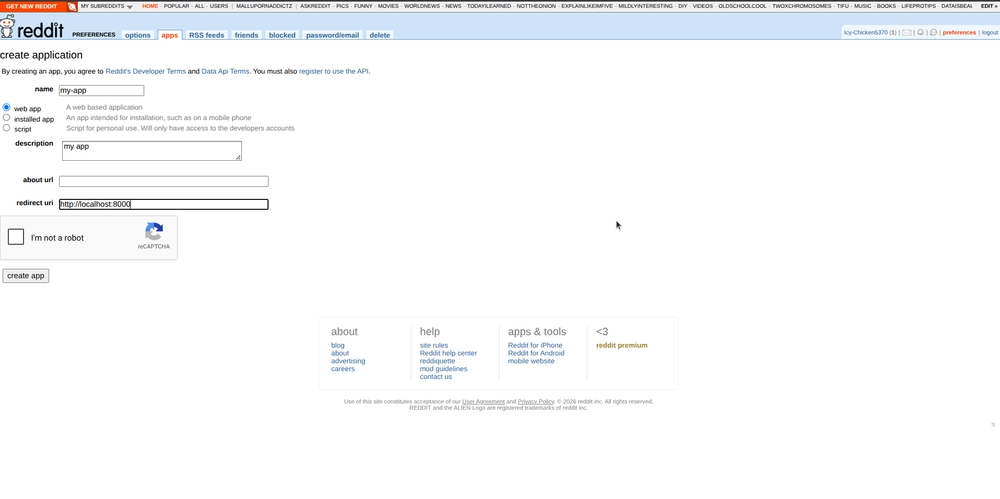

import Video from '@site/src/components/Video';
import { Steps, Step } from '@site/src/components/Steps/Steps';

# Reddit

Empower your agents to search discussions, opinions, and comments across **Reddit**.

This guide will walk you through generating a Reddit API credential, configuring the SVAHNAR tool, and building community intelligence workflows.

## 💡 Core Concepts

To configure this tool effectively, you need to understand the two search modes, the `target` field behavior, and the subreddit scoping model.

### 1. What can this tool do?

The Reddit tool searches posts and comments across Reddit communities — surfacing real user opinions, discussions, recommendations, and threads on any topic.

| Capability | Description |
| --- | --- |
| Keyword search | Search Reddit for posts and comments matching a keyword query across a subreddit or all of Reddit. |
| Direct URL fetch | Pass a direct Reddit post URL to retrieve the post and its comments. |
| Subreddit scoping | Restrict searches to a specific subreddit community. |

### 2. Authentication

This tool uses **Reddit API credentials** — a `client_id` and `client_secret` from a registered Reddit app, combined with a user agent string.

* **No OAuth popup required:** Credentials are registered once from the Reddit developer portal and stored in SVAHNAR. No per-user login flow needed.
* **Maintenance:** Reddit API credentials do not expire unless the app is deleted or the secret is manually rotated.

### 3. Two Search Modes

The `target` field controls which mode the tool operates in. The behavior differs significantly between the two:

| Mode | `target` Format | `subreddit` Field |
| --- | --- | --- |
| **Keyword Search** | Plain text query — e.g., `"best laptops for programming"` | Respected — scopes the search to that subreddit. Defaults to `"all"`. |
| **Direct URL Fetch** | A full Reddit post URL — e.g., `"https://www.reddit.com/r/programming/comments/10abcdef/..."` | **Ignored** — the URL already points to a specific post. |

:::tip
Use **Keyword Search** when you want broad community sentiment or recommendations on a topic. Use **Direct URL Fetch** when you already have a specific thread and want to retrieve its content and comments.
:::

### 4. Parameter Reference

| Parameter | Type | Required | Description | Example |
| --- | --- | --- | --- | --- |
| `target` | string | Yes | A search keyword string OR a direct Reddit post URL. | `"best laptops for programming"` or `"https://www.reddit.com/r/..."` |
| `subreddit` | string | No | The subreddit to search within. Default: `"all"`. Ignored when `target` is a URL. | `"programming"`, `"MachineLearning"`, `"all"` |

:::caution
Do not include the `r/` prefix in the `subreddit` field — pass just the name. `"programming"` is correct; `"r/programming"` will not work as expected.
:::

---

## 🔑 Prerequisites

<Steps>
<Step>

### Create a Reddit Account (if you don't have one)

1. Go to [https://www.reddit.com](https://www.reddit.com) and sign up for an account.
2. This account will be the owner of the API application — use a dedicated account for bots or automation, not a personal account.

</Step>

<Step>

### Register a Reddit App

1. Log in to Reddit and go to [https://www.reddit.com/prefs/apps](https://www.reddit.com/prefs/apps).
2. Scroll down and click **Create App** (or **Create Another App**).
3. Fill in the fields:
   * **Name:** `SVAHNAR Agent`
   * **App type:** Select **script** (for personal/server-side use).
   * **Description:** Optional.
   * **Redirect URI:** `http://localhost:8080` (required field — any valid URI works for script apps).
4. Click **Create app**.
5. Note the following from the created app:
   * **Client ID** — shown just below the app name (short alphanumeric string).
   * **Client Secret** — labeled as `secret`.



:::caution
Never commit your `client_secret` to version control or hardcode it in config files. Use SVAHNAR Key Vault (`${reddit_client_secret}`) to reference it safely.
:::

</Step>

<Step>

### Note Your User Agent

Reddit's API requires a descriptive **User Agent** string with every request. The recommended format is:

```
<platform>:<app_id>:<version> (by u/<your_reddit_username>)
```

Example:
```
svahnar:svahnar-agent:v1.0 (by u/svahnar_bot)
```

You will paste this string into the SVAHNAR tool config as `user_agent`.

:::note
Reddit enforces rate limits per user agent. Use a unique, descriptive user agent string — never use generic values like `"python"` or `"bot"`, which are flagged and throttled by Reddit's API.
:::

</Step>
</Steps>

---

## ⚙️ Configuration Steps

<Steps>
<Step>

### Add the Tool in SVAHNAR

1. Open your **SVAHNAR Agent Configuration**.
2. Add the **Reddit** tool and enter your API credentials:
   * `client_id` — from your Reddit app registration
   * `client_secret` — from your Reddit app registration
   * `user_agent` — your descriptive user agent string

3. Save the configuration.

</Step>

<Step>

### Verify the Connection

To confirm your credentials are working:

1. Trigger a test agent run with a simple keyword search:
```json
{
  "target": "python programming tips",
  "subreddit": "learnpython"
}
```
2. A valid response will return a list of matching Reddit posts with titles, scores, and top comments.
3. If you receive a `401 Unauthorized` error, your `client_id` or `client_secret` is incorrect — re-check your Reddit app registration.
4. If you receive a `429 Too Many Requests` error, your user agent is being rate-limited — ensure it follows the recommended format.

</Step>
</Steps>

---

## 📚 Practical Recipes (Examples)

### Recipe 1: Community Sentiment Research Agent

> **Use Case:** An agent that gauges real user opinions and recommendations on a product, tool, or topic from relevant subreddits.

```yaml showLineNumbers
create_vertical_agent_network:
  agent-1:
    agent_name: community_sentiment_agent
    LLM_config:
        params:
          model: gpt-4o
    tools:
      tool_assigned:
        - name: Reddit
          config:
            client_id: ${reddit_client_id}
            client_secret: ${reddit_client_secret}
            user_agent: ${reddit_user_agent}
    agent_function:
      - You are a community research assistant.
      - When the user asks for opinions on a topic, construct a clear keyword query for 'target'.
      - Choose a relevant 'subreddit' to scope the search — e.g., 'programming' for dev tools, 'personalfinance' for money topics, 'all' for broad sentiment.
      - Summarize the most upvoted posts and recurring themes in the comments.
      - Highlight both positive and negative sentiments found in the community.
    incoming_edge:
      - Start
    outgoing_edge: []
```

---

### Recipe 2: Thread Deep-Dive Agent

> **Use Case:** An agent that retrieves and summarizes a specific Reddit thread — including its top comments and key discussion points.

```yaml showLineNumbers
create_vertical_agent_network:
  agent-1:
    agent_name: thread_deepdive_agent
    LLM_config:
        params:
          model: gpt-4o
    tools:
      tool_assigned:
        - name: Reddit
          config:
            client_id: ${reddit_client_id}
            client_secret: ${reddit_client_secret}
            user_agent: ${reddit_user_agent}
    agent_function:
      - You are a thread analysis assistant.
      - When the user provides a Reddit post URL, pass it directly as 'target' — do not set 'subreddit' as it is ignored for URL fetches.
      - Retrieve the post content and top comments.
      - Summarize the original post, then list the top 5 most upvoted comments with their key point.
      - Flag any strong consensus or heated disagreements in the thread.
    incoming_edge:
      - Start
    outgoing_edge: []
```

---

### Recipe 3: Cross-Tool — Reddit Research → Notion Knowledge Base Agent

> **Use Case:** An agent that searches Reddit for insights on a topic and saves a structured summary to a Notion page.

```yaml showLineNumbers
create_vertical_agent_network:
  agent-1:
    agent_name: reddit_to_notion_agent
    LLM_config:
        params:
          model: gpt-4o
    tools:
      tool_assigned:
        - name: Reddit
          config:
            client_id: ${reddit_client_id}
            client_secret: ${reddit_client_secret}
            user_agent: ${reddit_user_agent}
        - name: Notion
          config:
            client_id: ${notion_client_id}
            client_secret: ${notion_client_secret}
            redirect_uri: ${notion_redirect_uri}
    agent_function:
      - You are a research capture agent.
      - Use Reddit to search for the user's topic across relevant subreddits — run 2-3 searches across different communities (e.g., the same topic in 'learnprogramming', 'cscareerquestions', and 'all').
      - Synthesize key findings, recurring recommendations, and community consensus into a structured summary.
      - Use Notion 'create_page' to save the summary as a new page — include the topic as the title, the Reddit queries used, and the synthesized insights as paragraph blocks.
    incoming_edge:
      - Start
    outgoing_edge: []
```

### 💡 Tip: SVAHNAR Key Vault

Never hardcode your `client_secret` in plain text files. Use SVAHNAR Key Vault references (e.g., `${reddit_client_secret}`) to keep credentials secure.

### 💡 Tip: Choosing the Right Subreddit

Scoping your search to the right subreddit dramatically improves result quality. Some useful communities by domain:

| Domain | Subreddit |
| --- | --- |
| General programming | `programming`, `learnprogramming` |
| Python | `Python`, `learnpython` |
| AI / Machine Learning | `MachineLearning`, `artificial` |
| Career advice (tech) | `cscareerquestions` |
| Startups / Entrepreneurship | `startups`, `entrepreneur` |
| Personal finance | `personalfinance`, `IndiaInvestments` |
| Product recommendations | `BuyItForLife`, `SuggestALaptop` |
| India-specific | `india`, `IndiaTech`, `IndianStartups` |

---

## 🚑 Troubleshooting

* **`401 Unauthorized`**
  * Your `client_id` or `client_secret` is incorrect. Go to [reddit.com/prefs/apps](https://www.reddit.com/prefs/apps), verify the credentials for your app, and update them in SVAHNAR Key Vault.
  * Ensure the app type is set to **script** — other app types use a different auth flow not supported by this tool.

* **`429 Too Many Requests`**
  * Reddit is rate-limiting your requests due to an invalid or generic user agent string.
  * Update your `user_agent` to follow Reddit's required format: `<platform>:<app_id>:<version> (by u/<username>)`. Generic strings like `"python"` or `"bot"` are aggressively throttled.

* **Keyword Search Returns No Results**
  * The query may be too specific or the subreddit too niche. Try broadening the `target` query or switching `subreddit` to `"all"` to search across all of Reddit.
  * Avoid special characters or punctuation in keyword queries — keep the `target` string clean and descriptive.

* **`subreddit` Field Being Ignored**
  * If `target` is a full Reddit URL, the `subreddit` field is intentionally ignored — the URL already specifies the post location. Only keyword search mode respects the `subreddit` field.

* **Direct URL Fetch Returns Empty Comments**
  * The post may have comments disabled, be newly posted with no comments yet, or the thread may have been locked or deleted.
  * Verify the URL is a valid, accessible Reddit post — open it in a browser to confirm it loads correctly before passing it as `target`.

* **`r/` Prefix in Subreddit Causing Errors**
  * Pass only the subreddit name without the `r/` prefix — e.g., `"programming"`, not `"r/programming"`. Including the prefix will break the subreddit scoping.