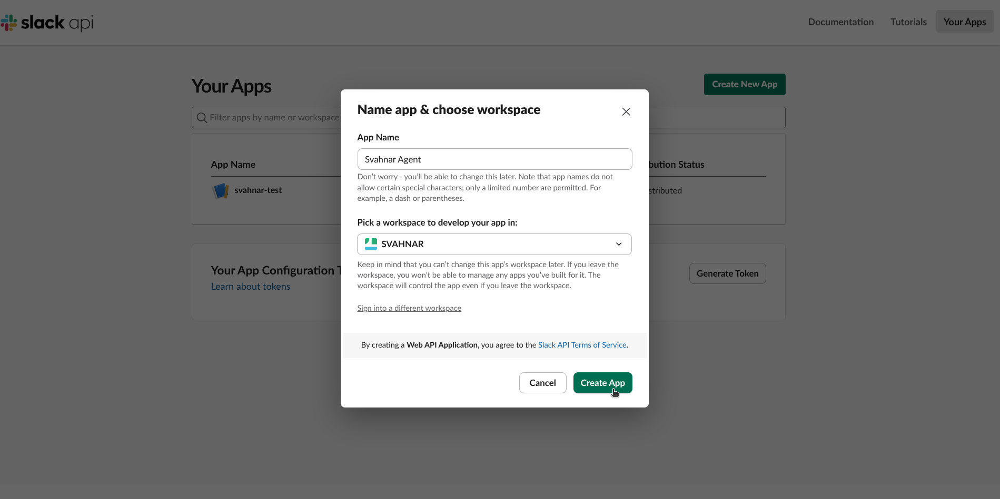
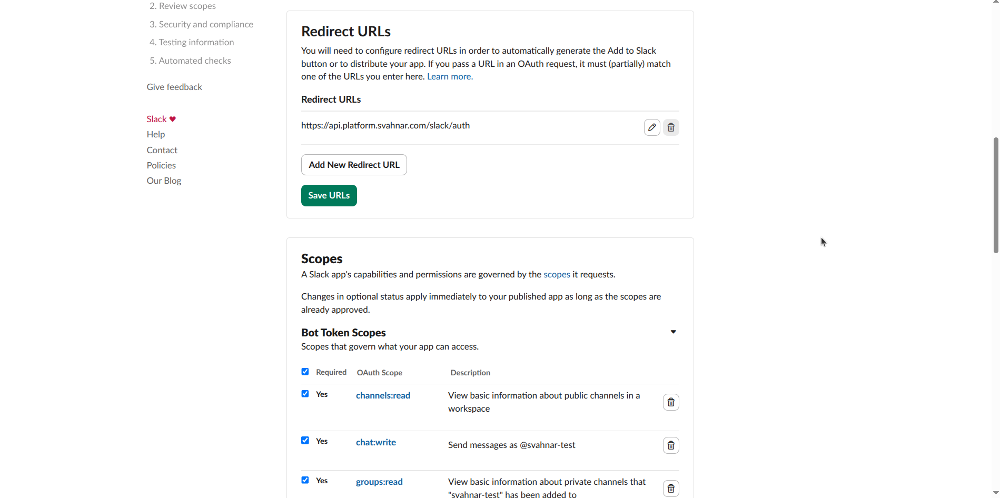
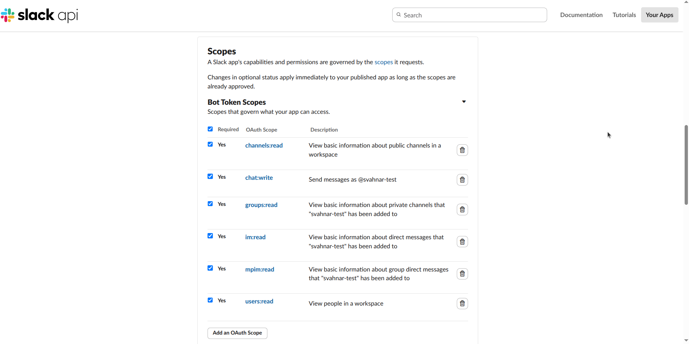

import Video from '@site/src/components/Video';
import { Steps, Step } from '@site/src/components/Steps/Steps';

# Slack

Empower your agents to send messages, read channel content, and schedule communications directly through **Slack**.

This guide will walk you through creating a Slack App, configuring OAuth credentials, and authenticating your workspace.

## 💡 Core Concepts

To configure this tool effectively, you need to understand the underlying capabilities, the operation model, and the parameter contract for each task.

### 1. What can this tool do?

The Slack tool interacts with the **Slack API** to perform messaging and channel operations across your workspace.

| Operation | Description |
| --- | --- |
| `get_channel` | Retrieve information about a Slack channel — ID, name, and topic. |
| `get_message` | Fetch messages from a channel by its channel ID. |
| `send_message` | Send a message immediately to a channel. |
| `schedule_message` | Schedule a message to be posted at a specified future timestamp. |

### 2. Authentication

This tool uses **Slack OAuth 2.0** — a `client_id` + `client_secret` pair from a registered Slack App that drives a workspace authorization flow.

* **First Run:** A workspace admin must complete the OAuth installation flow via the **Authenticate** button in the SVAHNAR tool UI to authorize the app and store tokens.
* **Token Storage:** After a successful installation, the bot access token is stored securely and resolved automatically on all subsequent calls.
* **Maintenance:** Slack bot tokens do not expire unless the app is uninstalled from the workspace or the token is manually revoked. If the tool stops working, re-run the authentication flow.

### 3. Operation Parameter Contract

Each operation requires a specific set of parameters in the payload:

| Operation | Required Parameters | Optional Parameters |
| --- | --- | --- |
| `get_channel` | `operation` | Channel name or ID to look up |
| `get_message` | `operation`, `channel_id` | Message limit, timestamp range |
| `send_message` | `operation`, `channel`, `text` | — |
| `schedule_message` | `operation`, `channel`, `message`, `timestamp` | — |

:::tip
Use `get_channel` first to look up a channel's ID before calling `get_message`, `send_message`, or `schedule_message`. Channel IDs (e.g., `C012AB3CD`) are required for message operations — channel names alone are not accepted.
:::

### 4. Scheduling Timestamps

The `schedule_message` operation requires a Unix epoch timestamp for the `timestamp` field — not a human-readable date string.

```
Current time (IST):  2025-12-24 10:00:00
Unix timestamp:      1735016400
```

:::tip
Use WolframAlpha or a simple conversion — `"unix timestamp for December 24 2025 10:00 IST"` — to get the correct epoch value before passing it to `schedule_message`.
:::

---

## 🔑 Prerequisites

<Steps>
<Step>

### Create a Slack App

1. Go to [https://api.slack.com/apps](https://api.slack.com/apps) and sign in with your Slack account.
2. Click **Create New App** → **From scratch**.
3. Enter an **App Name** (e.g., `SVAHNAR Agent`) and select the **workspace** to develop it in.
4. Click **Create App**.



</Step>

<Step>

### Configure OAuth Scopes

1. In your app settings, go to **OAuth & Permissions** in the left sidebar.
2. Under **Redirect URLs**, add your SVAHNAR callback URL:
```
https://api.platform.svahnar.com/slack/auth
```


3. Scroll down to **Bot Token Scopes** and add the following:

   | Scope | Required For |
   | --- | --- |
   | `channels:read` | `get_channel` — list and look up public channels |
   | `channels:history` | `get_message` — read messages from public channels |
   | `groups:read` | `get_channel` — list private channels the bot is in |
   | `groups:history` | `get_message` — read messages from private channels |
   | `chat:write` | `send_message` — post messages to channels |
   | `chat:write.public` | `send_message` — post to channels the bot hasn't joined |
   | `chat:scheduledMessages.write` | `schedule_message` — schedule future messages |

4. Click **Save Changes**.



:::note
`chat:write.public` allows the bot to send messages to any public channel without being manually invited first. Without it, the bot must be added to a channel before it can post there.
:::

</Step>

<Step>

### Get Client Credentials

1. In your app settings, go to **Basic Information** in the left sidebar.
2. Scroll down to **App Credentials**.
3. Note your:
   * **Client ID** — your `client_id`
   * **Client Secret** — your `client_secret`

:::caution
Copy the Client Secret immediately and store it in SVAHNAR Key Vault. Never commit it to version control or hardcode it in config files.
:::

</Step>
</Steps>

---

## ⚙️ Configuration Steps

<Steps>
<Step>

### Add the Tool in SVAHNAR

1. Open your **SVAHNAR Agent Configuration**.
2. Add the **Slack** tool and enter your App credentials:
   * `client_id` — from your Slack App's Basic Information page
   * `client_secret` — from your Slack App's Basic Information page

3. Save the configuration.

</Step>

<Step>

### Authenticate the Workspace

1. Click the **Authenticate** button in the Slack tool UI.
2. A Slack OAuth consent screen will appear — log in with a workspace admin account and authorize the app.
3. After approval, SVAHNAR stores the bot access token automatically.
4. The bot is now installed in the workspace and ready to use.

:::note
The user who completes the OAuth flow does not need to be in every channel the bot will message — the bot's channel access is governed by its scopes (`chat:write.public` allows posting to any public channel). For private channels, the bot must be manually invited with `/invite @SVAHNAR Agent`.
:::

</Step>

<Step>

### Invite the Bot to Private Channels (If Needed)

For any **private channels** the agent needs to read or post in:

1. Open the private channel in Slack.
2. Type `/invite @SVAHNAR Agent` (or whatever you named your app).
3. The bot will now have access to that channel's messages and can post there.

</Step>
</Steps>

---

## 📚 Practical Recipes (Examples)

### Recipe 1: Slack Notification & Alerting Agent

> **Use Case:** An agent that posts automated updates, alerts, and digests to designated Slack channels.

```yaml showLineNumbers
create_vertical_agent_network:
  agent-1:
    agent_name: slack_notifier_agent
    LLM_config:
        params:
          model: gpt-4o
    tools:
      tool_assigned:
        - name: Slack
          config:
            client_id: ${slack_client_id}
            client_secret: ${slack_client_secret}
    agent_function:
      - You are a Slack notification assistant.
      - Use 'get_channel' to look up the channel ID for the target channel name before sending.
      - Use 'send_message' with the resolved channel ID and composed message text to post the notification.
      - Keep messages concise and well-formatted — use Slack markdown (*bold*, `code`, >blockquote) for readability.
      - For non-urgent updates that should go out at a scheduled time, use 'schedule_message' with a Unix epoch timestamp instead of send_message.
    incoming_edge:
      - Start
    outgoing_edge: []
```

---

### Recipe 2: Channel Monitor & Digest Agent

> **Use Case:** An agent that reads recent messages from a channel and produces a summary digest.

```yaml showLineNumbers
create_vertical_agent_network:
  agent-1:
    agent_name: channel_digest_agent
    LLM_config:
        params:
          model: gpt-4o
    tools:
      tool_assigned:
        - name: Slack
          config:
            client_id: ${slack_client_id}
            client_secret: ${slack_client_secret}
    agent_function:
      - You are a channel monitoring assistant.
      - Use 'get_channel' to resolve the channel ID from the channel name provided by the user.
      - Use 'get_message' with the resolved channel_id to fetch recent messages.
      - Summarize the key discussion points, decisions made, and any action items mentioned in the thread.
      - Return a clean digest with a bullet-point summary — suitable for someone catching up after being away.
    incoming_edge:
      - Start
    outgoing_edge: []
```

---

### Recipe 3: Cross-Tool — GitLab → Slack Engineering Updates Agent

> **Use Case:** An agent that monitors open GitLab issues and posts a daily engineering standup digest to a Slack channel.

```yaml showLineNumbers
create_vertical_agent_network:
  agent-1:
    agent_name: gitlab_slack_standup_agent
    LLM_config:
        params:
          model: gpt-4o
    tools:
      tool_assigned:
        - name: GitLab
          config:
            GITLAB_PERSONAL_ACCESS_TOKEN: ${gitlab_token}
            GITLAB_REPOSITORY: ${gitlab_repo}
        - name: Slack
          config:
            client_id: ${slack_client_id}
            client_secret: ${slack_client_secret}
    agent_function:
      - You are a daily standup reporting agent.
      - Use GitLab 'get_issues' to fetch all open issues in the repository.
      - Group issues by label or priority and compose a clean standup digest — open blockers, in-progress items, and recently closed issues.
      - Use Slack 'get_channel' to resolve the engineering channel ID.
      - Use Slack 'send_message' to post the digest to the engineering channel with clear formatting.
      - Alternatively, if the digest should go out at a fixed morning time, use 'schedule_message' with the next day's 9:00 AM Unix timestamp.
    incoming_edge:
      - Start
    outgoing_edge: []
```

### 💡 Tip: SVAHNAR Key Vault

Never hardcode your `client_secret` in plain text files. Use SVAHNAR Key Vault references (e.g., `${slack_client_secret}`) to keep credentials secure.

### 💡 Tip: Slack Markdown in Messages

Slack supports its own markdown-like formatting for messages sent via the API. Use these in `send_message` and `schedule_message` text for clean, readable output:

| Format | Syntax |
| --- | --- |
| Bold | `*text*` |
| Italic | `_text_` |
| Strikethrough | `~text~` |
| Inline code | `` `code` `` |
| Code block | ` ```code block``` ` |
| Blockquote | `>text` |
| Mention user | `<@USER_ID>` |
| Mention channel | `<#CHANNEL_ID>` |
| Link | `&lt;https://url|display text&gt;` |

---

## 🚑 Troubleshooting

* **`401 Unauthorized` or Invalid Token**
  * The bot token is missing, expired, or the app was uninstalled from the workspace.
  * Click **Authenticate** again in the SVAHNAR tool UI to re-run the OAuth installation flow and store a fresh token.

* **`channel_not_found` on `send_message` or `get_message`**
  * The `channel` / `channel_id` value is incorrect or refers to a channel the bot cannot access.
  * Always use `get_channel` first to resolve the correct channel ID — IDs are alphanumeric strings starting with `C` for public channels and `G` for private groups.
  * For private channels, ensure the bot has been invited via `/invite @YourAppName`.

* **`not_in_channel` on `send_message`**
  * The bot is not a member of the target channel and the `chat:write.public` scope is missing.
  * Either add `chat:write.public` to your app's Bot Token Scopes and reinstall the app, or manually invite the bot to the channel.

* **`schedule_message` Posts at the Wrong Time**
  * Verify that the Unix timestamp is correct for the user's intended timezone. Unix timestamps are always UTC — if the user says "9 AM IST", convert to UTC first (IST is UTC+5:30, so 9 AM IST = 3:30 AM UTC = Unix timestamp for that moment).
  * Use WolframAlpha — `"unix timestamp for [date] [time] IST"` — to get the correct value.

* **`missing_scope` Error on Any Operation**
  * A required Bot Token Scope is missing from your Slack App. Go to **api.slack.com/apps → Your App → OAuth & Permissions → Bot Token Scopes**, add the missing scope, and reinstall the app (re-run the Authenticate flow) to apply the new scope.

* **Bot Not Appearing in Workspace After Authentication**
  * Confirm the OAuth flow was completed by a user with **workspace admin** permissions. Standard users may not have permission to install apps depending on your workspace's app management settings.
  * Check **Slack → Settings & Administration → Manage Apps** to confirm the app is listed as installed.