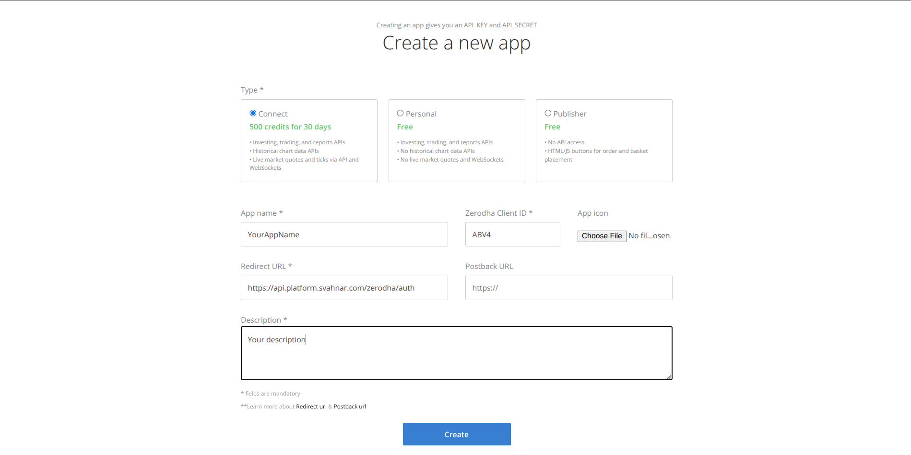

import Video from '@site/src/components/Video';
import { Steps, Step } from '@site/src/components/Steps/Steps';

# Zerodha

Empower your agents to fetch market data, place trades, and manage portfolios directly through **Zerodha Kite**.

This guide will walk you through generating your Kite Connect API credentials, configuring the SVAHNAR tool, and connecting your trading account.

## 💡 Core Concepts

To configure this tool effectively, you need to understand the underlying capabilities, the parameter contract, and the trading constraints.

### 1. What can this tool do?

The Zerodha tool interacts with the **Kite Connect API** to perform market data lookups and order management operations across NSE and BSE exchanges.

| Operation | Description |
| --- | --- |
| `get_ltp` | Fetch the Last Traded Price (LTP) of a stock in real time. |
| `search_instrument` | Look up instrument metadata for a ticker symbol. Use this to verify a symbol before placing orders. |
| `place_order` | Place a BUY or SELL order as MARKET or LIMIT execution. |
| `cancel_order` | Cancel an existing pending order by its order ID. |
| `order_history` | Fetch the full status history of a specific order by its order ID. |
| `positions` | Retrieve all current open positions in the portfolio. |

### 2. Authentication

This tool uses **Kite Connect Session Tokens** — an API key + access token pair.

* **API Key:** A static key tied to your Kite Connect app. Does not change unless you regenerate it.
* **Access Token:** A short-lived token generated fresh each trading day via the Kite login flow. **It expires at the end of every trading session (typically midnight IST).**
* **Daily Re-authentication:** Unlike other tools, the Zerodha access token must be refreshed every day before market open. Plan your agent's startup flow to handle token refresh.

:::caution
The access token is session-bound and expires daily. Storing a yesterday's token in Key Vault will cause `403` errors. Ensure your agent or deployment pipeline regenerates and updates the token before market hours.
:::

### 3. Order Parameter Contract

Every `place_order` call must strictly follow these rules:

| Parameter | Required When | Valid Values |
| --- | --- | --- |
| `trading_symbol` | `place_order`, `get_ltp`, `search_instrument` | Exact uppercase ticker — e.g., `INFY`, `RELIANCE`, `TCS` |
| `exchange` | Always (defaults to `NSE`) | `NSE` \| `BSE` |
| `transaction_type` | `place_order` | `BUY` \| `SELL` |
| `quantity` | `place_order` | Positive integer |
| `order_type` | `place_order` | `MARKET` \| `LIMIT` |
| `price` | Only if `order_type` is `LIMIT` | Must be `None` if `MARKET` |
| `order_id` | `cancel_order`, `order_history` | Numeric order ID from `place_order` response |

:::tip
Always call `search_instrument` first to verify a ticker symbol exists on the target exchange before placing any order. This prevents rejected orders due to symbol mismatches between NSE and BSE listings.
:::

---

## 🔑 Prerequisites

Zerodha's API access requires a **Kite Connect developer app**. This is separate from your regular Zerodha trading account.

<Steps>
<Step>

### Create a Kite Connect App

1. Log in to the [Kite Connect developer portal](https://developers.kite.trade).
2. Click **Create new app**.
3. Fill in the app name (e.g., `SVAHNAR Agent`), app type (**Connect**), and your Zerodha client ID.
4. Set the **Redirect URL** to your SVAHNAR callback endpoint:
```
https://api.platform.svahnar.com/zerodha/auth
```
5. Submit for review. Once approved, note your **API Key** and **API Secret**.



:::note
Kite Connect app creation may require a one-time fee. Check the current pricing at [kite.trade/connect](https://kite.trade/connect).
:::

</Step>

<Step>

### Generate the Daily Access Token

Kite Connect uses a **two-step login flow** to generate an access token. This must be repeated every trading day.

1. Direct the user (or your startup script) to the Kite login URL:
```
https://kite.zerodha.com/connect/login?v=3&api_key=<your_api_key>
```
2. After successful login, Kite redirects to your redirect URL with a `request_token` query parameter.
3. Exchange the `request_token` for an `access_token` by making a POST request to:
```
POST https://api.kite.trade/session/token
```
with `api_key`, `request_token`, and a checksum (SHA-256 of `api_key + request_token + api_secret`).
4. The response contains the `access_token`. Store it in SVAHNAR Key Vault immediately.

:::tip
Automate this daily token refresh using a scheduled script or a SVAHNAR startup hook so your agents are always authenticated before market open (9:15 AM IST).
:::

</Step>

<Step>

### Verify API Access

1. Use the `get_ltp` action with a known symbol (e.g., `INFY` on `NSE`) as a sanity check.
2. A valid price response confirms your `api_key` + `access_token` pair is working.
3. A `403` response means the access token has expired — re-run the token generation flow.

</Step>
</Steps>

---

## ⚙️ Configuration Steps

<Steps>
<Step>

### Add the Tool in SVAHNAR

1. Open your **SVAHNAR Agent Configuration**.
2. Add the **Zerodha** tool and enter your Kite Connect credentials:
   * `api_key` — from your Kite Connect app dashboard
   * `access_token` — generated fresh each trading day via the login flow

3. Save the configuration.

</Step>

<Step>

### Daily Token Refresh

Since the `access_token` expires at end of day, update it in SVAHNAR Key Vault before your agents run each morning:

1. Run your token generation script (from Step 2 of Prerequisites).
2. Update the `${zerodha_access_token}` value in SVAHNAR Key Vault with the new token.
3. Your agents will automatically pick up the new token on their next run — no restart needed.

</Step>
</Steps>

---

## 📚 Practical Recipes (Examples)

### Recipe 1: Market Research Agent

> **Use Case:** An agent that looks up live prices and verifies instrument details before any trade decision.

```yaml showLineNumbers
create_vertical_agent_network:
  agent-1:
    agent_name: market_research_agent
    LLM_config:
        params:
          model: gpt-4o
    tools:
      tool_assigned:
        - name: Zerodha
          config:
            api_key: ${zerodha_api_key}
            access_token: ${zerodha_access_token}
    agent_function:
      - You are a market research assistant.
      - When asked about a stock, first use 'search_instrument' to verify the trading_symbol exists on the target exchange.
      - Use 'get_ltp' to fetch the current Last Traded Price for the verified symbol.
      - Report the symbol, exchange, and current price clearly. Never assume a symbol is valid without calling search_instrument first.
    incoming_edge:
      - Start
    outgoing_edge: []
```

---

### Recipe 2: Autonomous Trade Execution Agent

> **Use Case:** An agent that validates a symbol, checks live price, and places a MARKET or LIMIT order based on user instructions.

```yaml showLineNumbers
create_vertical_agent_network:
  agent-1:
    agent_name: trade_execution_agent
    LLM_config:
        params:
          model: gpt-4o
    tools:
      tool_assigned:
        - name: Zerodha
          config:
            api_key: ${zerodha_api_key}
            access_token: ${zerodha_access_token}
    agent_function:
      - You are a trade execution assistant. Always act with caution — confirm all parameters with the user before placing any order.
      - Use 'search_instrument' to validate the trading_symbol on the specified exchange before proceeding.
      - Use 'get_ltp' to fetch the current price and present it to the user for awareness.
      - For MARKET orders, set price to None. For LIMIT orders, confirm the target price with the user explicitly.
      - Use 'place_order' with the validated symbol, exchange, transaction_type (BUY or SELL), quantity, order_type, and price.
      - After placing, report back the order_id for tracking. Use 'order_history' to confirm the order status.
    incoming_edge:
      - Start
    outgoing_edge: []
```

---

### Recipe 3: Portfolio Monitor & Order Management Agent

> **Use Case:** An agent that reviews open positions and handles order cancellations.

```yaml showLineNumbers
create_vertical_agent_network:
  agent-1:
    agent_name: portfolio_monitor_agent
    LLM_config:
        params:
          model: gpt-4o
    tools:
      tool_assigned:
        - name: Zerodha
          config:
            api_key: ${zerodha_api_key}
            access_token: ${zerodha_access_token}
    agent_function:
      - You are a portfolio monitoring assistant.
      - Use 'positions' to retrieve all open positions and summarize the current portfolio — symbol, quantity, average buy price, and current P&L.
      - If the user requests to cancel a pending order, ask for the order_id and use 'cancel_order' to cancel it.
      - Use 'order_history' with the order_id to confirm the cancellation status after cancelling.
    incoming_edge:
      - Start
    outgoing_edge: []
```

### 💡 Tip: SVAHNAR Key Vault

Never hardcode your `api_key` or `access_token` in plain text files. Use SVAHNAR Key Vault references (e.g., `${zerodha_api_key}`, `${zerodha_access_token}`) to keep credentials secure. Since the access token rotates daily, ensure your token refresh script always writes to Key Vault — not to a local file.

---

## ⚠️ Important Disclaimers

:::danger
**This tool places real trades with real money.** Always validate trading symbols, quantities, and order types before execution. SVAHNAR and Kite Connect do not offer an undo for executed MARKET orders — they are filled immediately at the current market price.
:::

* This tool is intended for **personal or authorized trading accounts only**. Automated trading via APIs must comply with [SEBI's algorithmic trading regulations](https://www.sebi.gov.in).
* Ensure your Kite Connect app is approved for the actions your agent performs. Unauthorized or excessive API usage may result in account suspension by Zerodha.
* Test all agent workflows in **paper trading or with minimum quantities** before running them at full scale.

---

## 🚑 Troubleshooting

* **`403 Forbidden` on Any Request**
  * Your `access_token` has expired (it resets at end of every trading session).
  * Re-run the Kite login flow to generate a fresh access token and update it in SVAHNAR Key Vault.

* **Order Rejected — Invalid Symbol**
  * Always call `search_instrument` before `place_order`. A symbol valid on NSE may not exist on BSE and vice versa.
  * Use the exact uppercase ticker (e.g., `RELIANCE`, not `Reliance` or `RELIANCE.NS`).

* **`price` Field Causing Errors**
  * For `MARKET` orders, `price` must be explicitly set to `None` — do not pass `0` or omit the key.
  * For `LIMIT` orders, `price` must be a positive number matching the exchange's tick size for that instrument.

* **`cancel_order` Returns "Order not found"**
  * Only **pending** orders can be cancelled. If the order was already executed (filled) or previously cancelled, this action will fail.
  * Use `order_history` with the `order_id` first to confirm the current order status before attempting cancellation.

* **`positions` Returns an Empty List**
  * Positions reflect intraday open trades. If all positions were squared off or if no trades were placed today, this will return empty.
  * For holdings (long-term delivery positions), this action does not apply — holdings require a separate API endpoint not covered by this tool.